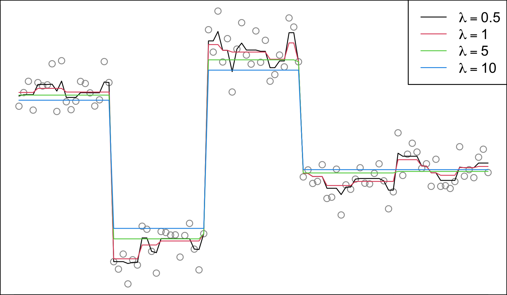

<!-- README.md is generated from README.Rmd. -->

# tvdenoising

<!-- badges: start -->

[](https://github.com/glmgen/tvdenoising/actions/workflows/R-CMD-check.yaml)
[](https://CRAN.R-project.org/package=tvdenoising)
<!-- badges: end -->

The `tvdenoising` package provides an implementation of an efficient
linear-time dynamic programming algorithm for univariate total variation
denoising (also called fused lasso signal approximation), due to
[Johnson (2013)](https://doi.org/10.1080/10618600.2012.681238), which
computes the exact solution, for a given regularization level $\lambda$.
You can also find a concise explanation of the algorithm at [this
link](https://www.stat.berkeley.edu/~ryantibs/papers/tvdp.pdf).



## Installation

To install the released version from CRAN:

``` r
install.packages("tvdenoising")
```

To install the development version from GitHub:

``` r
# install.packages("pak")
pak::pak("glmgen/tvdenoising")
```
